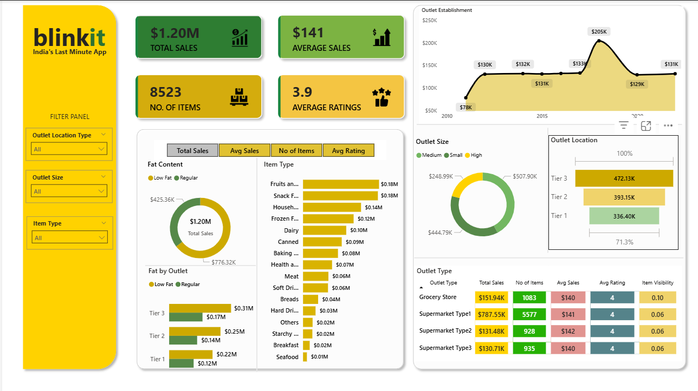

# 🛒 Blinkit Sales Analysis Dashboard



## 📌 Project Overview
This project presents a comprehensive **Blinkit Sales Analysis Dashboard** built in **Power BI** to analyze sales performance, customer satisfaction, inventory distribution, and outlet performance across multiple dimensions.

The dashboard helps uncover valuable business insights through interactive visualizations and KPI tracking, enabling better business decision-making and operational optimization.

---

# 🎯 Business Problem
Blinkit operates across multiple outlet types, sizes, and locations with thousands of products. Understanding sales patterns, customer preferences, and inventory behavior is critical for improving profitability and customer satisfaction.

This dashboard was created to:

- Analyze overall sales performance
- Understand customer ratings and preferences
- Compare outlet performance
- Identify top-performing product categories
- Evaluate the impact of outlet size and location on sales

---

# 📊 Key Performance Indicators (KPIs)

| KPI | Value |
|------|------|
| 💰 Total Sales | $1.20M |
| 📦 Number of Items | 8523 |
| ⭐ Average Rating | 3.9 |
| 📈 Average Sales | $141 |

---

# 📈 Dashboard Features

## 1️⃣ Total Sales Analysis
- Overall revenue generated across all products
- Sales contribution by different product categories

## 2️⃣ Fat Content Analysis
- Comparison between:
  - Low Fat Products
  - Regular Products
- Impact of fat content on:
  - Total Sales
  - Average Sales
  - Ratings

## 3️⃣ Item Type Performance
Analysis of product categories such as:
- Fruits & Vegetables
- Snack Foods
- Dairy
- Frozen Foods
- Household Items
- Bakery
- Seafood
- Meat

---

## 4️⃣ Outlet Establishment Trends
Visual representation of:
- Sales performance over outlet establishment years
- Growth patterns across years

---

## 5️⃣ Outlet Size Analysis
Comparison of:
- Small Outlets
- Medium Outlets
- High Outlets

Based on:
- Revenue contribution
- Sales percentage

---

## 6️⃣ Outlet Location Analysis
Sales comparison across:
- Tier 1 Cities
- Tier 2 Cities
- Tier 3 Cities

---

## 7️⃣ Outlet Type Analysis
Comprehensive comparison of:
- Grocery Stores
- Supermarket Type 1
- Supermarket Type 2
- Supermarket Type 3

Metrics included:
- Total Sales
- Number of Items
- Average Sales
- Average Ratings
- Item Visibility

---

# 🛠️ Tools & Technologies Used

| Tool | Purpose |
|------|------|
| Power BI | Data Visualization & Dashboard Creation |
| Excel / CSV | Data Source |
| DAX | Data Analysis Expressions |
| Power Query | Data Cleaning & Transformation |

---

# 📂 Project Structure

```bash
Blinkit-Analysis/
│
├── DASHBOARD.png
├── README.md
└── BLINKIT ANALYSIS (POWERBI).pbit


---

📌 Insights Derived

✅ Tier 3 outlets generated the highest sales revenue.

✅ Regular fat products contributed more sales compared to low-fat products.

✅ Fruits and Snack Foods were among the top-performing categories.

✅ Medium-sized outlets showed strong sales performance.

✅ Supermarket Type 1 had the highest number of items sold.


---

📷 Dashboard Snapshot


---

🚀 How to Use

1. Download the project files


2. Open the .pbit Power BI file


3. Refresh the dataset if required


4. Interact with filters and visualizations


---

📊 Business Impact

This dashboard can help businesses:

Improve inventory management

Optimize outlet performance

Understand customer buying patterns

Increase operational efficiency

Support data-driven decision making


---

🔮 Future Enhancements

Real-time sales integration

Predictive sales forecasting

Customer segmentation analysis

Regional demand prediction

Advanced drill-through analytics


---

👩‍💻 Author

Shravani Badabe

📧 Aspiring Data Analyst | Power BI Enthusiast
📊 Passionate about transforming raw data into actionable insights.


---

⭐ If You Like This Project

Give this repository a ⭐ on GitHub and share your feedback!


---
